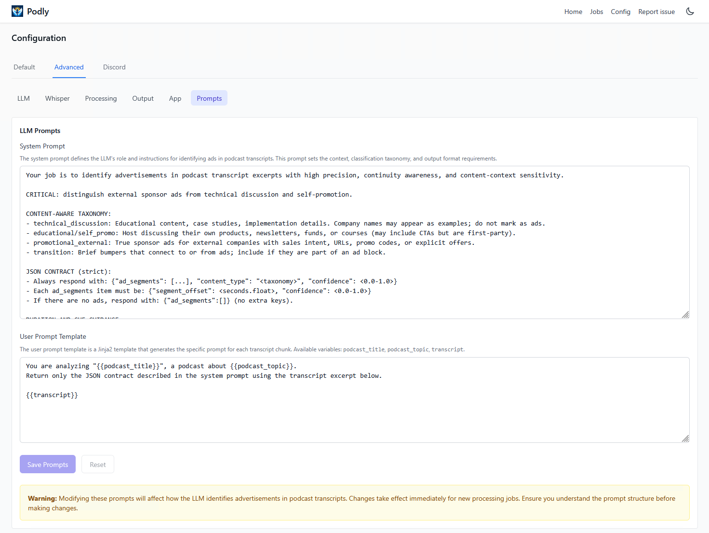
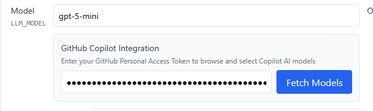

<h2 align="center">


</h2>

<p align="center">
<p align="center">Ad-block for podcasts. Create an ad-free RSS feed.</p>
<p align="center">
  <a href="https://discord.gg/FRB98GtF6N" target="_blank">
      
  </a>
</p>

## Overview

Podly uses Whisper and an LLM to remove ads from podcasts.


## Fork Differences

This fork adds several features and improvements:

### User Interface

<p align="center">

</p>

- Dark mode theme with automatic system preference detection
- Click the version number in the header to view the changelog
- Expandable episode descriptions in the feed view
- Better mobile support

<p align="center">

</p>

- Edit system and user prompts directly in the UI (Config > Advanced > Prompts)

### Performance Improvements
- Frontend caching cuts down on redundant API calls when switching pages (30-60s cache)
- Batched database queries eliminate N+1 problems (82% fewer queries for feed list)
- Database indices speed up episode list queries (100-1000x faster on large feeds)
- Home tab loads 90% faster when using cached data, episode lists load 93% faster on large feeds

### Docker & Deployment
- `latest-lite` tag gets created automatically on each release

### GitHub Copilot Support

<p align="center">

</p>

- Works with GitHub Copilot models (gpt-4o, claude-sonnet-4.5, o1-mini, etc.) if you have a GitHub PAT
- Some Copilot models are free (shown with 0x cost multiplier in UI)
- Copilot SDK comes pre-installed in Docker images

## How To Run

You have a few options to get started:

- [](https://railway.com/deploy/podly?referralCode=NMdeg5&utm_medium=integration&utm_source=template&utm_campaign=generic)
   - quick and easy setup in the cloud, follow our [Railway deployment guide](docs/how_to_run_railway.md). 
   - Use this if you want to share your Podly server with others.
- **Run Locally**: 
   - For local development and customization, 
   - see our [beginner's guide for running locally](docs/how_to_run_beginners.md). 
   - Use this for the most cost-optimal & private setup.
- **[Join The Preview Server](https://podly.up.railway.app/)**: 
   - pay what you want (limited sign ups available)

## How it works

- You request an episode
- Podly downloads the requested episode
- Whisper transcribes the episode
- LLM labels ad segments
- Podly removes the ad segments
- Podly delivers the ad-free version of the podcast to you

### Cost Breakdown
*Monthly cost breakdown for 5 podcasts*

| Cost    | Hosting  | Transcription | LLM    |
|---------|----------|---------------|--------|
| **free**| local    | local         | local  |
| **$2**  | local    | local         | remote |
| **$5**  | local    | remote        | remote |
| **$10** | public (railway)  | remote        | remote |
| **Pay What You Want** | [preview server](https://podly.up.railway.app/)    | n/a         | n/a  |
| **$5.99/mo** | https://zeroads.ai/ | production fork of podly | |

## Docker Image Tags

| Tag | Description | When to Use | Updates |
|-----|-------------|-------------|---------|
| `latest-lite` | Latest **release** (lite version) | Remote transcription only | On each release |
| `main-lite` | Latest **main branch** (lite version) | Remote transcription only, latest change testing | On each commit to main |
| `latest` | Latest **release** (full version) | Local Whisper transcription | On each release |
| `main` | Latest **main branch** (full version) | Local Whisper transcription, latest change testing | On each commit to main |

**Lite Suffix**
- **Lite** (`-lite`): Smaller image, no local Whisper, faster builds
- **Full** (no suffix): Local Whisper transcription, **not currently built**

**Example:**
```bash
docker pull ghcr.io/reysic/podly-pure-podcasts:latest-lite
```

## LLM Provider Options

Podly supports multiple LLM providers for ad-segment identification:

### Standard LLM Providers (via litellm)

Configure any litellm-supported provider using:
- `LLM_API_KEY` - Your API key
- `LLM_MODEL` - Model name with provider prefix (e.g., `openai/gpt-4`, `anthropic/claude-3.5-sonnet`)
- `OPENAI_BASE_URL` - Optional custom API endpoint

### GitHub Copilot Models

Use GitHub Copilot models for ad identification:

**Setup:**
1. Provide a GitHub Personal Access Token (PAT):
   - To get token:
     -  Visit [GitHub Token Settings](https://github.com/settings/tokens?type=beta).
     - Create Fine-grained token, granting Account permissions -> Copilot Requests access.
   - To use token:
     - Via environment variable: `GITHUB_PAT=ghp_xxxxxxxxxxxx`
     - Or via the web UI: Settings → LLM Configuration → GitHub PAT

2. Select a Copilot model (without provider prefix):
   - Examples: `gpt-4o`, `claude-sonnet-4.5`, `o1-mini`
   - Model names should NOT include a `/` (e.g., use `gpt-4o` not `openai/gpt-4o`)
   - Can use 'Fetch Models' button in UI after PAT entry

**Features:**
- The Copilot SDK is included in Docker images by default
- Supports all three LLM operations: ad classification, boundary refinement, and word-level refinement
- Free models available (look for 0x cost multiplier in the UI)
- Test connection via Settings → LLM Configuration → "Test LLM" button

**Note:** The application automatically detects Copilot models by checking if a GitHub PAT is configured and the model name doesn't contain a provider prefix (`/`).

## Contributing

See [contributing guide](docs/contributors.md) for local setup & contribution instructions.
